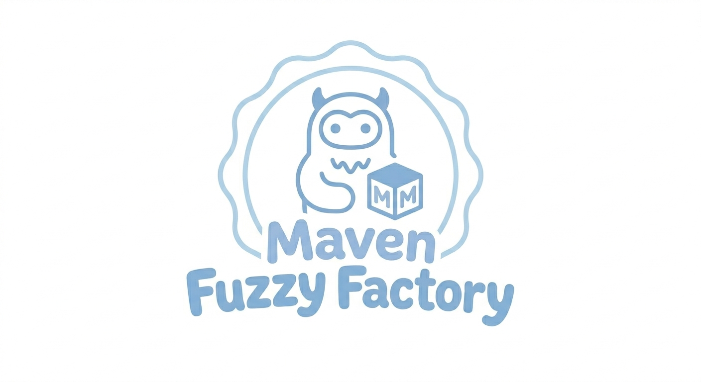

# E-Commerce Funnel Analysis for Maven Fuzzy Factory

## Executive Summary

Maven Fuzzy Factory, an e-commerce toy store, needed to understand where users were dropping off in their online purchase journey. Using SQL and Power BI, the analysis revealed that the largest opportunity lies at the "Add to Cart" stage, where significant user drop-off occurs. The analysis also identified a notable conversion gap between mobile and desktop users. Based on these findings, focusing on cart abandonment recovery and optimizing the mobile shopping experience can increase overall conversion rates and revenue.

---

### Business Problem

Maven Fuzzy Factory relies on completed purchases for revenue, but stakeholders noticed the website's conversion rate was lower than expected. The challenge was to determine exactly where users were falling out of the purchase workflow and identify actionable improvements. This analysis directly addresses revenue leakage by pinpointing the funnel stages with the highest drop-off rates.

---

## Results & Business Recommendations

### 1. Where the Funnel Leaks

The analysis of 140,571 sessions revealed that 11,233 completed a purchase. While the overall conversion rate sits at 8.06%, Maven Fuzzy Factory faces a primary bottleneck at the "Viewed Product → Added to Cart" stage, where a significant 61.1% drop-off rate occurs. Over 50,000 potential customers are lost at the product interest stage alone. The data suggests Maven Fuzzy Factory needs to optimize Product Page engagement or review pricing competitiveness to drive higher purchase intent.

### 2. The Mobile Conversion Gap

To understand what drives the drop-off, the analysis broke down performance by device type. While mobile accounts for 30.2% of total traffic, it suffers from a severe 69.7% drop-off rate during the "Viewed Product → Add to Cart" transition—significantly higher than Desktop's 58.1%. Desktop users convert at 10.05%, generating $625,608 in revenue with $6.38 revenue per session. Mobile users, in stark contrast, convert at only 3.45%, generating $91,660 in revenue with just $2.16 revenue per session. This critical friction point is the primary driver behind mobile's underperformance. Maven Fuzzy Factory should prioritize streamlining the Mobile Product Page UI/UX to capture this lost revenue.

### 3. Products That Need Attention

To identify product-level issues, the analysis expanded beyond the recent 6-month period to include all available data. This larger scope was necessary because product quality patterns, such as refund rates, require a statistically significant sample size to draw reliable conclusions. The all-time data revealed that while "The Original Mr. Fuzzy" is the most stable product with the lowest refund rate at 7.15%, two products show alarmingly high refund rates exceeding 34%: "The Birthday Sugar Panda" at 34.72% and "The Hudson River Mini Bear" at 34.50%. These high-refund products risk damaging Maven Fuzzy Factory's long-term margins and customer satisfaction. Action: Audit quality control for these specific items.

---

### Recommendations

Based on the data, here are the summary of recommended actions:

1. **Address Cart Abandonment**: The **marketing team** should implement cart abandonment emails or push notifications to encourage users to complete their purchase after adding items to cart.

2. **Optimize Mobile Experience**: The **product & UX team** should investigate and improve the mobile checkout flow to reduce the conversion gap between mobile and desktop users.

3. **Focus Marketing Budget**: The **digital marketing team** should concentrate advertising spend on higher-converting channels and device types based on UTM performance data.

4. **Monitor Monthly Trends**: The **analytics team** should track conversion rate changes over time to measure the impact of implemented improvements.

5. **Review Product Quality**: The **operations team** should investigate high-refund products like "The Birthday Sugar Panda" and "The Hudson River Mini Bear" to identify and address quality or description issues.

These changes target the largest drop-off points in the funnel, which will directly impact revenue growth and improve overall conversion efficiency.

---

### Next Steps

1. A/B test copy changes at the cart stage to improve completion rates
2. Conduct user research on mobile checkout to identify friction points
3. Implement and measure cart abandonment email campaign effectiveness
4. Set up automated monitoring for monthly conversion trend alerts

---

### Methodology

1. **Project Planning & Task Tracking**: Used OpenCode AI assistant as a structured project management tool to plan analysis scope, track task progress, and maintain documentation throughout the project lifecycle. This ensured systematic execution rather than ad-hoc exploration.

2. **SQL Pipeline**: Extracted and transformed raw data from multiple tables (website_sessions, website_pageviews, orders, order_items) using complex queries with CTEs, joins, and conditional aggregation. Created nine reusable views to standardize funnel metrics for Power BI.

3. **Power BI Dashboard**: Connected directly to SQLite database to pull live data. Transformed date columns and established proper data relationships in the data model. Built a multi-page interactive dashboard featuring KPI cards, funnel charts, trend lines, and detailed breakdowns by device and marketing channel.

4. **Filtering & Scope**: Focused on the last six months of available data (October 2014 - March 2015) to ensure relevance and actionable insights. Product-level analysis used all-time data to ensure statistical reliability.